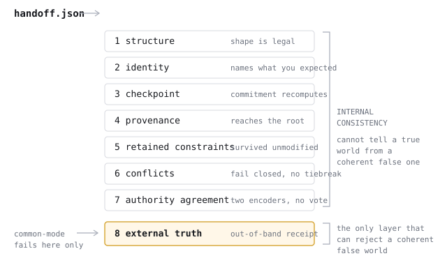

# Auditing Context Handoffs in Long-Running AI Agents

**A contract and deterministic verifier for agent handoff artifacts, and the
limits of verifying them**

Scott Henry and Anthony Colasante · v0.1 draft · August 2026

> **Status: draft technical report. Not submitted anywhere, not peer reviewed.**
>
> **Every experimental result in this report comes from deterministic scripted
> fixtures. No language model was contacted at any point in this work.** Where
> a result is described, the apparatus that produced it is named. Claims about
> real agent behaviour are not made because no real agent was observed.

---

## Abstract

Long-running AI agents lose context. When an agent exhausts its window, ends a
session, or hands work to another agent, the successor inherits a summary
rather than the run that produced it. Constraints, decisions, and open
questions live in that summary, and they can disappear from it without anything
in the toolchain noticing.

We define a small machine-readable contract for handoff artifacts and a
deterministic verifier for it. The contract records what a producing agent
claims happened and, separately, what must survive into the next agent. The
verifier runs eight checks and reports each independently: structural validity,
identity, checkpoint binding, provenance connectivity, constraint survival,
conflict state, agreement between two independently implemented encoders, and
acceptance by an out-of-band receipt.

Our central negative result is that the first seven of these are *internal
consistency* and cannot in principle distinguish a true handoff from a coherent
false one. We construct a handoff that satisfies all seven — commitments
recompute, provenance connects, both encoders agree — and describes a
repository state that never existed. Only a receipt issued outside the artifact
rejects it, which relocates trust rather than eliminating it.

We report the verifier's behaviour on fifteen deterministic failure classes,
each generated from one clean artifact by one named mutation, and measure the
integrity machinery's cost at 32.3% of the example artifact. We do not report
real-model results, and we describe the controlled evaluation that would be
needed to obtain them.

---

## 1. Motivation

Every frontier model degrades as input length grows [Hong et al. 2025], so
compaction is not an optional optimisation — it is what long-running agents do.
Each compaction is a handoff from a past self to a future self, and each session
boundary is a handoff between agents.

Empirically, these boundaries are expensive. Handoff debt [KC and Budathoki
2026] measures the rediscovery cost when a coding agent resumes an interrupted
task and finds that repository state alone leaves successors re-deriving what
their predecessor already knew, at substantial cost in agent events and prompt
tokens. Compaction validation work [Chen et al. 2026] finds that standard
compaction methods remove information agents need to complete tasks.

Both results are about *cost* and *capability*. The question this report asks is
adjacent and, we think, unaddressed: given that a handoff artifact exists, **can
you check it?** Not whether the successor performs well, but whether the thing
it inherited still satisfies what the predecessor promised.

That question is tractable in a way the general one is not. It does not require
running an agent, and its answer is deterministic.

## 2. Problem definition

Let a *handoff artifact* be a structured document produced by agent A at the
end of its run and consumed by agent B at the start of its own.

Given an artifact *H*, and optionally an *expectation* *E* stating what must
survive, decide whether *H* satisfies the contract. Specifically:

1. **Structural** — is *H* well-formed under a declared contract version?
2. **Identity** — does *H* concern the work *E* names?
3. **Binding** — does *H*'s checkpoint commitment recompute from the state
   *H* carries?
4. **Provenance** — does every assertion in *H* trace to *H*'s declared
   authority root through connected, acyclic edges?
5. **Survival** — are the constraints, objects and open issues *E* requires
   still present in *H*, unmodified?
6. **Conflict** — does *H* contain contradictory assertions about one object
   with no declared resolution?
7. **Agreement** — do independent encodings of *H* describe the same world?
8. **Truth** — did anything outside *H* accept the world *H* describes?

The framing that makes this useful is that (8) is *categorically different* from
(1)–(7), and that a system reporting them as one number destroys the
distinction.

## 3. Threat and failure model

We assume a **non-adversarial producer that is unreliable**: an agent that
intends to record the handoff correctly and fails, through compaction,
summarisation loss, or re-deriving a settled decision differently. This is the
realistic failure mode and it is the one we address.

We explicitly do **not** address an adversarial producer. Every commitment in an
artifact is computed by the producer over the producer's own claims. A producer
that lies from the start produces an artifact that verifies. The machinery
detects drift and corruption *after the fact*, and calling it tamper-evidence
would be wrong.

### Failure classes

| Class | Description | Detectable from one artifact? |
|---|---|---|
| **F1** structural corruption | malformed or truncated artifact | yes |
| **F2** binding corruption | state edited after commitment | yes |
| **F3** constraint loss | a required constraint no longer carried | only against an expectation |
| **F4** constraint mutation | constraint keeps its id, changes meaning | only against an expectation |
| **F5** provenance break | assertion no longer reaches the authority root | yes |
| **F6** alias collapse | compaction makes two names denote one thing | yes |
| **F7** representational ambiguity | one name bound twice; readers disagree | only with two independent readers |
| **F8** conflict | contradictory assertions, no declared rank | yes |
| **F9** summary drift | prose no longer matches the state it describes | yes |
| **F10** compression loss | required object dropped by compaction | only against an expectation |
| **F11** replay | a valid but stale artifact presented as current | only against an expectation |
| **F12** silent reversal | a decision changed with no record of the change | **no** — needs the predecessor |
| **F13** common-mode | internally perfect artifact, wrong world | **no** — needs an external receipt |

F12 and F13 are the interesting rows. They are the failures a single-artifact
verifier structurally cannot catch, and stating that plainly is more useful than
a tool that quietly does not catch them.

## 4. The handoff contract

Full specification: [`docs/HANDOFF_CONTRACT.md`](../docs/HANDOFF_CONTRACT.md).
Normative schema: [`schema/babel-handoff-0.1.schema.json`](../schema/babel-handoff-0.1.schema.json).

The design constraint was that **every field must have a law** — something the
verifier actually checks. A field that could not be checked would be decoration,
and decoration in a trust artifact is worse than nothing. This is what kept v0.1
to fourteen top-level fields when the internal research apparatus had many more.

Three commitments are taken, each with a domain-separated SHA-256 over a fully
specified canonical JSON encoding:

- **the checkpoint** binds the artifact to the state it carries;
- **the summary** binds the prose a successor reads to the structured world;
- **the world** is what independent encoders must agree on.

The *world* is the meaning of an artifact after alias resolution, replacing
values with digests, and canonical ordering. Two artifacts that serialise
differently but mean the same thing share a world digest. This is what makes
semantic diff possible.

### The expectation

An artifact declares what it carries. An expectation declares what a successor
is *required* to carry, and is committed to the repository by a human rather
than written by the agent under test.

This asymmetry is load-bearing. An agent that omits a constraint has produced a
smaller, entirely valid artifact; without an external statement of what must
survive, F3, F4, F10 and F11 are undetectable. Verification without an
expectation is still meaningful — it catches F1, F2, F5, F6, F7, F8, F9 — but it
cannot know what was supposed to be there.

## 5. Verification architecture



Eight layers, run in order, reported separately, never averaged. Each ends in
one of three states:

| State | Meaning |
|---|---|
| `verified` | the check ran and the artifact satisfied it |
| `failed` | the check ran and the artifact did not satisfy it |
| `not established` | the artifact did not supply what the check needs |

The third state is the design decision we would defend hardest. An artifact
with no external receipt is not clean at that layer; it is unexamined there.
Reporting that difference is what separates a verifier from a rubber stamp, and
no system in our review makes it.

### 5.1 Implementation diversity

Two components are implemented twice on purpose.

**The structural validator.** A native hand-written validator (so the tool has
no runtime dependencies) and a published JSON Schema (so other languages can
validate). A parity test runs both against every fixture and twelve
deliberately malformed artifacts and fails if they ever disagree.

**The world encoder.** *Authority A* walks the artifact as a nested document,
resolving aliases through a dictionary. *Authority B* shreds it into flat sorted
relation tuples and reconstitutes the world by joining them. They share nothing
but their output schema.

Diversity here is not redundancy. It is the only mechanism by which one
implementation notices its own blind spot. The concrete case (F7): an alias
table binds one short name to two targets. A's dictionary keeps the last binding
silently — what almost any hand-written parser does — and reports nothing. B's
join keeps both and produces a different world. **No vote is taken.** The
artifact is ambiguous, and reporting the disagreement is more useful than
picking a winner.

This mirrors the strongest result from the private apparatus: a second,
separately implemented verifier reproduced all 80 of the first verifier's prior
decisions *and* exposed 16 alias-structure acceptances the first had missed.

### 5.2 Failing closed

Equal-rank conflicts (F8) and encoder disagreement (F7) both refuse rather than
resolve. Selecting a value by document order would be arbitrary, and an
arbitrary choice presented as a verdict is worse than an admitted failure.

## 6. Experimental apparatus

### 6.1 What is real and what is fiction

**The scenario is fictional.** A coding agent migrating an auth layer to OIDC,
handing off to a successor. There is no such repository.

**The agents are not agents.** They are deterministic Python functions that
construct dictionaries. Nothing infers, generates, or reasons.

**What is real is the verifier's behaviour** on those artifacts. That is the
only claim the lab makes, and it is a claim about software, not about models.

We are explicit about this because the phrase "agent handoff" invites the reader
to assume agents were involved. They were not.

### 6.2 Method

One clean artifact. Fifteen cases, each produced by **one named mutation** of
it, so the difference between pass and fail is always a single readable edit.

Each case declares in advance its expected verdict *and the layer that should
catch it*. A case that fails at the wrong layer fails the lab even when the
verdict matches — otherwise the layering claim would be untested.

```bash
pip install -e ".[dev]"
babelci lab
```

### 6.3 The private apparatus

The public design derives from a private, fully offline research programme
using scripted fixture agents, whose closeout reproduction was executed during
preparation of this report: 283 focused tests passing, all 14 result digests
matching a frozen manifest, protected tree digest unchanged, **0 network or
model-contact attempts**. Its recorded state is
`SOFTWARE_FRONTIER_CLOSED_AND_PARKED` with real-model execution readiness
`NO AUTHORIZATION`.

Those results are cited in [`docs/RESULTS.md`](../docs/RESULTS.md) Table 2 as
**provenance for design decisions**, and are marked as not reproducible from the
public repository. No public claim in this report depends on them.

## 7. Results

### 7.1 Failure classes and where they are caught

| Case | Class | Verdict | Caught at |
|---|---|---|---|
| `clean` | — | PASS | — |
| `restart-resume` | — | PASS | — |
| `constraint-dropped` | F3 | FAIL | retained constraints |
| `constraint-softened` | F4 | FAIL | retained constraints |
| `decision-reversed` | F12 | **PASS** | *(diff REFUSEs)* |
| `checkpoint-mismatch` | F2 | FAIL | checkpoint |
| `summary-drift` | F9 | FAIL | retained constraints |
| `provenance-break` | F5 | FAIL | provenance |
| `alias-collapse` | F6 | FAIL | provenance |
| `authority-disagreement` | F7 | FAIL | authority agreement |
| `compression-loss` | F10 | FAIL | retained constraints |
| `duplicate-conflict` | F8 | FAIL | conflicts |
| `stale-replay` | F11 | FAIL | checkpoint |
| `externally-confirmed` | — | PASS | — |
| `common-mode` | F13 | FAIL | **external truth only** |

15/15 reached their declared verdict at their declared layer. Reproduce with
`babelci lab`; the report includes a `lab_digest` stable across runs.

### 7.2 Cost

| Quantity | Value |
|---|---|
| Example artifact, total | 21,848 bits |
| — content | 14,792 bits |
| — integrity machinery | 7,064 bits (**32.3%**) |

The integrity machinery is a third of the artifact. It is not free, and a
project claiming otherwise would be hiding the trade.

The private apparatus, which carried full proofs rather than commitments, found
a worse result: proof plus summary exceeded the *original context* by 5,520 bits
(referential) and 5,888 (compositional). Carrying enough evidence to prove a
summary cost more than sending the thing the summary replaced. The public
contract's use of commitments rather than proofs is a direct consequence.

### 7.3 The central negative result

`common-mode` is an artifact whose producer scanned the wrong branch. Every fact
in it is wrong. It passes:

```
structure ............. verified
identity .............. verified
checkpoint ............ verified
provenance ............ verified
retained constraints .. verified
conflicts ............. verified
authority agreement ... verified
external truth ........ FAILED
```

This is asserted by a test that iterates every layer rather than checking a
verdict, so the claim cannot quietly weaken.

Two encodings sharing no code agree completely about a world that never
existed, because they are both reading the same artifact. Agreement establishes
that the artifact is *unambiguous*. It says nothing about whether it is *true*.

Precision about scope: `diff` against a correct predecessor *does* catch this
one, because a decision changed. An agent whose first handoff describes the
wrong world has no predecessor, and then nothing local catches it. Both halves
are asserted in the test suite.

## 8. Common-mode failure, and what follows from it

The private apparatus produced the sharper version of this result: **six
coherent wrong worlds were accepted by all six normal verification paths** —
two authority encodings, two proof verifiers, two raw adjudication paths — and
rejected only by a separately constructed receipt.

More verifiers did not help, because the verifiers were not the problem. Every
path read the same artifact. Adding a seventh would have added a seventh reader
of the same false story.

This is what closed the private software programme. The recorded conclusion was
that further apparatus expansion had diminishing returns: no software
construction eliminates the named trust root, it only moves it.

The public design inherits that conclusion structurally. The external-truth
layer exists to make the trust root *nameable* — the `trust_root` field forces
whatever you are now trusting to be written down — not to remove it. A project
claiming to have removed it would be claiming something we have direct evidence
against.

## 9. Limitations

Full list: [`docs/LIMITS.md`](../docs/LIMITS.md). The load-bearing ones:

**Proof is not truth.** A commitment, digest, seal, or agreement between
verifiers establishes internal consistency. It cannot establish that the world
described occurred. This is the central limitation, demonstrated rather than
asserted.

**No real model was involved.** Not in this report and not in the private
apparatus. Every agent is a fixture. Nothing here is evidence about how real
agents behave.

**The lab is not a benchmark.** Fifteen cases on one fictional scenario
characterise the verifier's behaviour on that scenario. They are not prevalence
estimates.

**Non-adversarial threat model.** Producer-computed commitments over
producer-authored claims. Not tamper-evidence.

**Contract completeness is unestablished.** We do not know that the fourteen
fields capture what matters about a handoff. That would require observing real
handoffs failing.

**Two encoders are not independent replication.** Both were written by the same
authors, in the same language, against the same schema. Implementation
diversity, not scientific independence.

## 10. Related work

Reviewed in full in [`docs/RELATED_WORK.md`](../docs/RELATED_WORK.md).

The space is crowded and we make no priority claim. **CLAN** is the closest
system: a handoff file format with manifest checksums, a JSON Schema enforcing
output contracts, a `validate` command, and provenance attribution enforced at
write time. Structured agent handoffs, schema validation of them, and
provenance on agent state all predate this work.

The `agent-handoff` GitHub topic carried 20+ active projects as of August 2026.
ESAA-Conversational [dos Santos Filho 2026] captures conversation events and
projects `handoff.md`, `decisions.md` and `tasks.json`. The OpenAI Agents SDK
validates handoff payloads against a schema at the routing boundary.

What we have not found elsewhere: layers reported independently rather than
combined; `not established` distinguished from `verified`; two encoders with no
tiebreak; an expectation committed separately from the artifact; and an
external-truth layer that can reject what every other layer accepted.

## 11. Future real-model evaluation

Designed, not authorised, not run. Full design:
[`docs/ROADMAP_REAL_MODEL.md`](../docs/ROADMAP_REAL_MODEL.md).

Three arms over one task set — prose baseline, contract, enforced contract —
measuring survival rate per contract element, `MUST` violation rate,
rediscovery cost, and verifier yield by layer.

The measurement that matters most: **how often does a real handoff pass every
internal layer and still describe the wrong world?** The `common-mode` case is
hand-constructed. Its real-world rate is unknown, and it determines whether the
external-truth layer is a footnote or the main event.

Publishing this report does not authorise that work and does not change the
recorded `NO AUTHORIZATION` state.

## 12. Reproducibility

```bash
git clone <repository>
cd babel-context-integrity
python -m venv .venv && ./.venv/bin/pip install -e ".[dev]"

./.venv/bin/python -m pytest -q      # full suite
./.venv/bin/babelci lab              # 15 cases
./.venv/bin/babelci demo             # the walkthrough
./action/test-local.sh               # the CI action, locally
```

No network is required after install; the suite is run in CI with outbound
traffic rejected at the firewall. Determinism:

```bash
babelci lab --json > a.json && babelci lab --json > b.json && diff a.json b.json
```

Reproducibility appendix, including what is *not* reproducible from this
repository: [`REPRODUCIBILITY.md`](REPRODUCIBILITY.md).

## References

See [`references.md`](references.md).

---

## Acknowledgements and status

This is a v0.1 draft prepared alongside the software release. It has not been
submitted, reviewed, or edited by anyone outside the project.

The most useful contribution a reader could make is an argument that the
central negative result is wrong — that there is a construction under which
internal consistency does establish truth. We do not believe there is, and we
would like to be shown otherwise.
